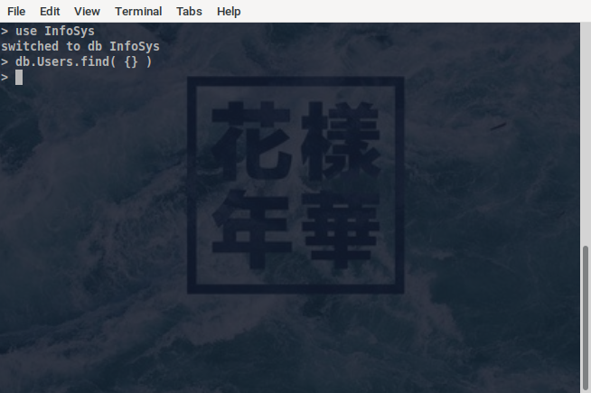
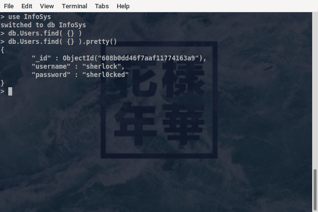
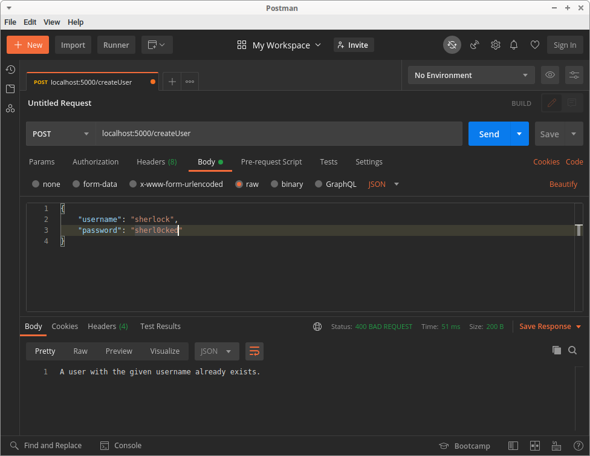

# Semester Project #01

## DS-UNIPI: Information Systems - 2021

This is a Flask application.
It implements basic CRUD API services for a MongoDB database along
with a rudimentary login authentication and session authorization system.

---

### Setup

#### The Database side

* ##### mongodb docker image

    Even though this project would work with a MongoDB installation
    the **mongo docker image** is used for testing the project instead.
    Thus if installing MongoDB isn't preferred an installation of [docker](https://www.docker.com/)
    is sufficient for working with this project.
    
    **Pulling the mongo docker image** can be done with the command:
    
    `$ (sudo) docker pull mongo`
    
    For this project to work correctly, the mongodb docker container will
    have to be named **mongodb** and listen at **localhost's port 27017**:

    * `name:` mongodb
    * `port:` 27017

    This can be set running the mongo docker image with the command:

    `$ (sudo) docker run -d -p 27017:27017 --name mongodb mongo`

* ##### database

    The database named **InfoSys** will be running in the **mongodb docker container**.
    It will contain two collections:

    * the **Students** collection,

        * The *students.json* file can be used to populate the Students collection

            * Copy the *students.json* file into the mongodb docker container as:

            `$ (sudo) docker cp students.json mongodb:/students.json`

            * Import *students.json* into the **Students** collection in the **InfoSys** database using this command.

            `$ (sudo) docker exec -it mongodb mongoimport --db=InfoSys --collection=Students --file=students.json`

            (*this command will create the InfoSys database and the Students collection if they aren't yet present.*)

    * and the **Users** collection.

    

#### The Flask application

* ##### Python 3

    Running this application requires an installation of [Python 3](https://www.python.org/downloads/)

* ##### ( *recommended* ) *virtual enviroment*

    Using [virtualenv](https://pypi.org/project/virtualenv/) allows for an isolated enviroment for
    running, testing and installing necessary packages for this project.
    
    To create a *virtual enviroment* with `virtualenv` named `env` enter:

    `$ virtualenv env`
    
    and to activate the *virtual enviroment* `env` enter the command
    
    `$ source env/bin/activate`
    
    to deactivate it enter:
    
    `$ deactivate`

* ##### pymongo and flask

    The application uses:

    * **pymongo** to interact with the database within the mongodb docker container
    * **flask** to implement the API Endpoints.

    Preferably using a *virtual enviroment* `pip` install **pymongo** and **flask** like so:

    `(env)...$ pip install pymongo flask`

* ##### *Initial `app.py`* script

    The **initial** `app.py` script (provided by the lab professors) can be described abstractly by the following steps:

    1. *Import all of the necessary modules for the whole project*
    2. *Connect to the local mongodb and access the database InfoSys*
    3.  *Select the Students and Users collections*
    4.  *Initialize the flask application*
    5.  *Define the `users_sessions` dictionary*
    6.  *Define helper functions `create_session(username)` and `is_session_valid(user_uuid)`*
    7.  *Define routes and function templates for all the required API-Endpoints and for each one:*
        * *implement the data fetching logic*
        * *include comments describing required functionality and desired status codes*
        * *return response on success*
    8.  *Start the flask application*

    There are three important objects to understand in the setup part of the project:
    
    * The `users_sessions` dictionary:
    
        It is a dictionary which stores valid or active user sessions.
        Each user session is in the format: `user_uuid: (username, time)`.
        So the `users_sessions` at any point (if not empty) is in the form:
        
        ```py
        users_sessions = {
            user_uuid_1: (username_1, time_1),
            user_uuid_2: (username_2, time_2),
            
                        ...
            
            user_uuid_N: (username_N, time_N)
        }
        ```

        It is kept updated by `create_session(username)` during a login and
        is used by `is_session_valid(user_uuid)` for session authorization.

    * The `create_session(username)` function:
        Essentially it creates a new session for a user:
        1. It gets passed a `username` as an argument.
        2. It generates a uuid for the user with the use of the `uuid1()` of the `uuid` module.
        3. It inserts `user_uuid: (username, time)` as a new key-value in the `users_sessions` dictionary.
        4. It returns the generated `user_uuid`.

        

    * The `is_session_valid(user_uuid)` function:
        Checks if the user has an valid or active session:
        1. It gets passed a `user_uuid` as an argument. 
        2. It checks if the given `user_uuid` is a key in the `users_sessions` dictionary:
            * if it is, it returns `True`.
            * if it is **not**, it returns `False`.

        

#### Testing the application

It is recommended to use [Postman](https://www.postman.com/) for testing this
application and to make requests to all the API Endpoints.

---

### Implementing Project Requirements and Testing

The requirement for the project is the implementation of **9 *API Endpoints***
for the Flask application within the `app.py` script.

As already mentioned in the **Setup**, *the data fetching logic* is already implemented,
so this parts of the endpoints are not described here.

What is really required is the implementation of the core functionality of each endpoint.

<br/>

#### The API Endpoints

---

1. **`[ POST ] ( endpoint ): /createUser`**

    Expects user to pass json data to the body of the request.
    An example for the expected format for the json is shown:

    ```json
    {
        "username": "sherlock",
        "password": "sherl0cked"
    }
    ```
    The endpoint's method `create_user()` requests the json,
    handles the cases for exceptions, improper json content
    and incomplete json information, returning with the
    appropriate response for each case.

    * ##### Implementation

        1.  Check if a user with the username given in the data already exists in **Users**
            * if he does exist then return with an error response with `status = 400`
        
            this check is implemented with the following if statement:

            ``` py
                if users.find( { 'username': data[ 'username' ] } ).count() != 0:
                    return Response(
                        'A user with the given username already exists.',
                        status = 400,
                        mimetype = 'application/json'
                    )
            ```

        2.  Insert the new user to **Users** (this step is reached only in case
            there is no user in **Users** with the username given in the data).
            
            this is implemented using the following statement:

            ```py
                users.insert_one( {
                    'username': data[ 'username' ],
                    'password': data[ 'password' ]
                } )
            ```

        3.  return with a success response with `status = 200`, which is implemented as:

            ```py
                return Response(
                    data[ 'username' ] + ' was added to the MongoDB',
                    status = 200,
                    mimetype = 'application/json'
                )
            ```

    * ##### Testing

        1.  In the terminal start the mogno shell in interactive mode by entering:

            `$ (sudo) docker exec -it mongodb mongo`

            Using database database **InfoSys** find all Users (should be empty):
            
            

        2.  Use **Postman** to make the request.
        
            * Type **`localhost:5000/createUser`** in the **URL field**.
            * Set the request method to **`POST`**.
            * Write the request data as **`raw`** **`json`** in the request **body** as
            
                ```json
                {
                    "username": "sherlock",
                    "password": "sherl0cked"
                }
                ```
            * Push the **Send** button.

            As shown in the screenshot below, the request
            got a success responses with `status = 200`:
            
            

            
        3.  Using mongo shell find all Users after the request (user is indeed present)
        
            

        4.  If the exact same request is made since a user with the username given
            in the data already exists an error response is returned `status = 400`:

            

---