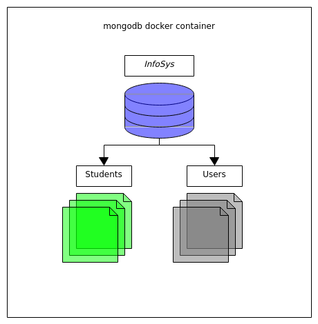

# Semester Project #01

#### DS-UNIPI: Information Systems - 2021

This is a Flask application.
It implements basic CRUD API services for a MongoDB database
along with a rudimentary login and session authentication system.

---

## Setup

#### The Database side

* ##### mongodb docker image

    Even though this project would work with a MongoDB installation
    the **mongo docker image** is used for testing the project instead.
    Thus if installing MongoDB isn't preferred an installation of [docker](https://www.docker.com/)
    is sufficient for working with this project.
    
     

    **Pulling the mongo docker image** can be done with the command:
    
    `$ (sudo) docker pull mongo`
    
     

    For this project to work correctly, the mongodb docker container will
    have to be named **mongodb** and listen at **localhost's port 27017**:

    * `name:` mongodb
    * `port:` 27017

     

    This can be set running the mongo docker image with the command:

    `$ (sudo) docker run -d -p 27017:27017 --name mongodb mongo`

* ##### database

    The database named **InfoSys** will be running in the **mongodb docker container**.
    It will contain two collections:

     

    * the **Students** collection,

        * The *students.json* file can be used to populate the Students collection

            * Copy the *students.json* file into the mongodb docker container as:

            `$ (sudo) docker cp students.json mongodb:/students.json`

            * Import *students.json* into the **Students** collection in the **InfoSys** database using this command.

            `$ (sudo) docker exec -it mongodb mongoimport --db=InfoSys --collection=Students --file=students.json`

            (*this command will create the InfoSys database and the Students collection if they aren't yet present.*)

     

    * and the **Users** collection.

     

    

#### The Flask application

* ##### Python 3

    Running this application requires an installation of [Python 3](https://www.python.org/downloads/)

* ##### ( *recommended* ) *virtual enviroment*

    Using [virtualenv](https://pypi.org/project/virtualenv/) allows for an isolated enviroment for
    running, testing and installing necessary packages for this project.

     
    
    To create a *virtual enviroment* with `virtualenv` named `env` enter:

    `$ virtualenv env`
    
    and to activate the *virtual enviroment* `env` enter the command
    
    `$ source env/bin/activate`
    
    to deactivate it enter:
    
    `$ deactivate`

* ##### pymongo and flask

    The application uses:

    * **pymongo** to interract with the database within the mongodb docker container
    * **flask** to implement the API Endpoints.

     

    Preferably using a *virtual enviroment* `pip` install **pymongo** and **flask** like so:

    `(env)...$ pip install pymongo flask`

#### Testing the application

It is recommended to use [Postman](https://www.postman.com/) for testing this
application and to make requests to all the API Endpoints.

---
