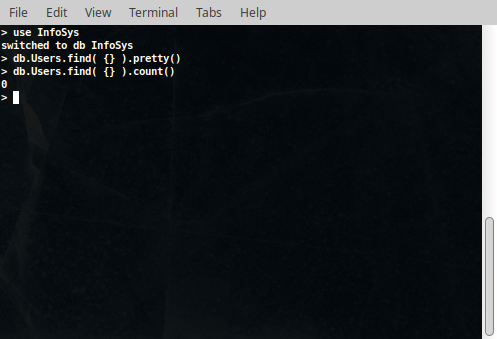
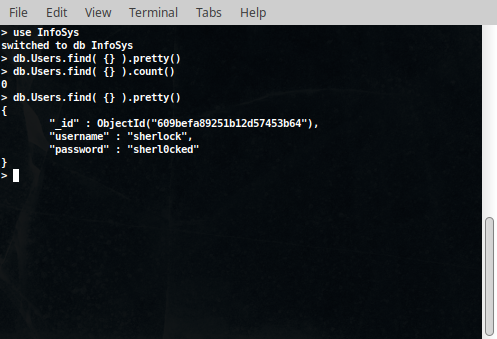
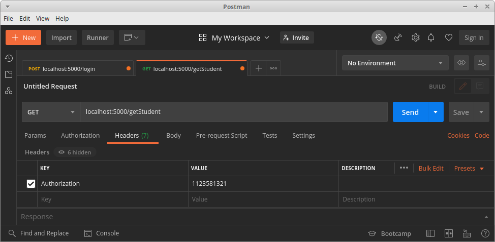
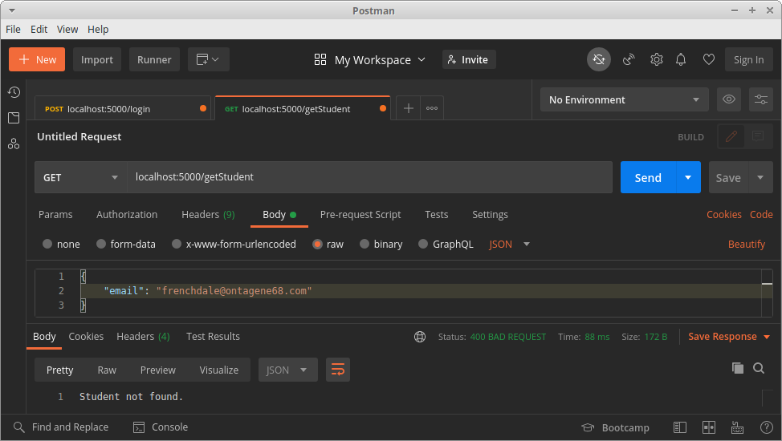
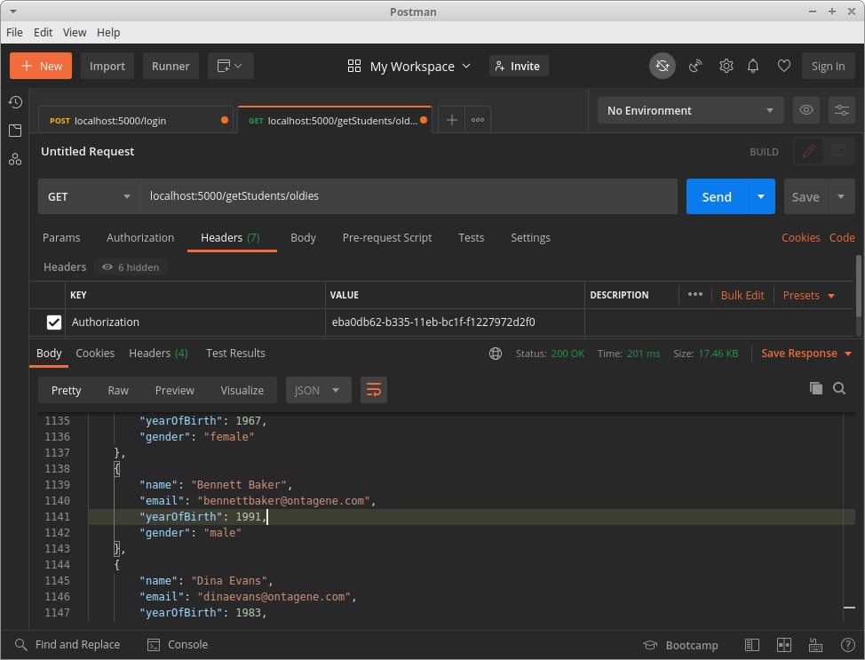

# Semester Project #01

## DS-UNIPI: Information Systems - 2021

This is a Flask application.
It implements basic CRUD API services for a MongoDB database along
with a rudimentary login authentication and session authorization system.

---

### Setup

#### The Database side

* ##### mongodb docker image

    Even though this project would work with a MongoDB installation
    the **mongo docker image** is used for testing the project instead.
    Thus if installing MongoDB isn't preferred an installation of [docker](https://www.docker.com/)
    is sufficient for working with this project.
    
    **Pulling the mongo docker image** can be done with the command:
    
    `$ (sudo) docker pull mongo`
    
    For this project to work correctly, the mongodb docker container will
    have to be named **mongodb** and listen at **localhost's port 27017**:

    * `name:` mongodb
    * `port:` 27017

    This can be set running the mongo docker image with the command:

    `$ (sudo) docker run -d -p 27017:27017 --name mongodb mongo`

* ##### database

    The database named **InfoSys** will be running in the **mongodb docker container**.
    It will contain two collections:

    * the **Students** collection,

        * The *students.json* file can be used to populate the Students collection

            * Copy the *students.json* file into the mongodb docker container as:

            `$ (sudo) docker cp students.json mongodb:/students.json`

            * Import *students.json* into the **Students** collection in the **InfoSys** database using this command.

            `$ (sudo) docker exec -it mongodb mongoimport --db=InfoSys --collection=Students --file=students.json`

            (*this command will create the InfoSys database and the Students collection if they aren't yet present.*)

    * and the **Users** collection.

    

#### The Flask application

* ##### Python 3

    Running this application requires an installation of [Python 3](https://www.python.org/downloads/)

* ##### ( *recommended* ) *virtual enviroment*

    Using [virtualenv](https://pypi.org/project/virtualenv/) allows for an isolated enviroment for
    running, testing and installing necessary packages for this project.
    
    To create a *virtual enviroment* with `virtualenv` named `env` enter:

    `$ virtualenv env`
    
    and to activate the *virtual enviroment* `env` enter the command
    
    `$ source env/bin/activate`
    
    to deactivate it enter:
    
    `$ deactivate`

* ##### pymongo and flask

    The application uses:

    * **pymongo** to interact with the database within the mongodb docker container
    * **flask** to implement the API Endpoints.

    Preferably using a *virtual enviroment* `pip` install **pymongo** and **flask** like so:

    `(env)...$ pip install pymongo flask`

* ##### *Initial `app.py`* script

    The **initial** `app.py` script (provided by the professors) can be described abstractly by the following steps:

    1. *Import all of the necessary modules for the whole project*
    2. *Connect to the local mongodb and access the database InfoSys*
    3.  *Select the Students and Users collections*
    4.  *Initialize the flask application*
    5.  *Define the `users_sessions` dictionary*
    6.  *Define helper functions `create_session(username)` and `is_session_valid(user_uuid)`*
    7.  *Define routes and function templates for all the required API-Endpoints and for each one:*
        * *implement the data fetching logic*
        * *include comments describing required functionality and desired status codes*
        * *return response on success*
    8.  *Start the flask application*

    There are three important objects to understand in the setup part of the project:
    
    * The `users_sessions` dictionary:
    
        It is a dictionary which stores valid or active user sessions.
        Each user session is in the format: `user_uuid: (username, time)`.
        So the `users_sessions` at any point (if not empty) is in the form:
        
        ```js
        users_sessions: {
            user_uuid_1: [ username_1, time_1 ],
            user_uuid_2: [ username_2, time_2 ],
            
                        ...
            
            user_uuid_N: [ username_N, time_N ]
        }
        ```

        It is kept updated by `create_session(username)` during a login and
        is used by `is_session_valid(user_uuid)` for session authorization.

    * The `create_session(username)` function:
        Essentially it creates a new session for a user:
        1. It gets passed a `username` as an argument.
        2. It generates a uuid for the user with the use of the `uuid1()` of the `uuid` module.
        3. It inserts `user_uuid: (username, time)` as a new key-value in the `users_sessions` dictionary.
        4. It returns the generated `user_uuid`.

        

    * The `is_session_valid(user_uuid)` function:
        Checks if the user has an valid or active session:
        1. It gets passed a `user_uuid` as an argument. 
        2. It checks if the given `user_uuid` is a key in the `users_sessions` dictionary:
            * if it is, it returns `True`.
            * if it is **not**, it returns `False`.

        

#### Testing the application

It is recommended to use [Postman](https://www.postman.com/) for testing this
application and to make requests to all the API Endpoints.
During testing the flask app and mongodb must be running,
the students collection must be populated with the students.json file.

---

### Implementing Project Requirements and Testing

The requirement for the project is the implementation of **9 *API Endpoints***
for the Flask application within the `app.py` script.

As already mentioned in the **Setup**, *the data fetching logic* is already implemented,
so this parts of the endpoints are not described here.

What is really required is the implementation of the core functionality of each endpoint.

<br/>

#### The API Endpoints

---

1. **`[ POST ] ( endpoint ): /createUser`**

    Expects user to pass json data to the body of the request.
    An example for the expected format for the json is shown:

    ```json
    {
        "username": "sherlock",
        "password": "sherl0cked"
    }
    ```
    The endpoint's method `create_user()` requests the json,
    handles the cases for exceptions, improper json content
    and incomplete json information, returning with the
    appropriate response for each case.

    * ##### Implementation

        1.  Check if a user with the username given in the data already exists in **Users**
            * if he does exist then return with an error response with `status = 400`
        
            this check is implemented with the following if statement:

            ``` py
                if users.find( { 'username': data[ 'username' ] } ).count() != 0:
                    return Response(
                        'A user with the given username already exists.',
                        status = 400,
                        mimetype = 'application/json'
                    )
            ```

        2.  Insert the new user to **Users** (this step is reached only in case
            there is no user in **Users** with the username given in the data).
            
            this is implemented using the following statement:

            ```py
                users.insert_one( {
                    'username': data[ 'username' ],
                    'password': data[ 'password' ]
                } )
            ```

        3.  return with a success response with `status = 200`, which is implemented as:

            ```py
                return Response(
                    'The user ' + data[ 'username' ] + ' was added to the database.',
                    status = 200,
                    mimetype = 'application/json'
                )
            ```

    * ##### Testing

        1.  In the terminal start the mogno shell in interactive mode by entering:

            `$ (sudo) docker exec -it mongodb mongo`

            Using database database **InfoSys** find all Users (should be empty):
            
            

        2.  Use **Postman** to make the request.
        
            * Set the request method to **`POST`**.
            * Type **`localhost:5000/createUser`** in the **URL field**.
            * Write the request data as **`raw`** **`json`** in the request **body** as
            
                ```json
                {
                    "username": "sherlock",
                    "password": "sherl0cked"
                }
                ```
            * Push the **Send** button.

            As shown in the screenshot below, the request
            got a success responses with `status = 200`:
            
            

            
        3.  Using mongo shell find all Users after the request (user is indeed inserted)
        
            

        4.  If the exact same request is made since a user with the username given
            in the data already exists an error response is returned `status = 400`:

            

---

2. **`[ POST ] ( endpoint ): /login`**

    Expects user to pass json data to the body of the request.
    An example for the expected format for the json is shown:

    ```js
    {
        "username": "sherlock",
        "password": "sherl0cked"
    }
    ```
    The endpoint's method `login()` requests the json,
    handles the cases for exceptions, improper json content
    and incomplete json information, returning with the
    appropriate response for each case.

    * ##### Implementation

        1.  Check if username and password correspond to an existing user in **Users**
            *   if there is no user with the provided username and password the
                return with an error response with `status = 400`
        
            this check is implemented with the following if statement:

            ``` py
                if users.find( {
                    'username': data[ 'username' ],
                    'password': data[ 'password' ]
                } ).count() == 0:
                    
                    return Response(
                        'Wrong username or password.',
                        status = 400,
                        mimetype = 'application/json'
                    )
            ```

        2.  (This step is reached only in case that the previous check 
            was false i.e. user is valid) creat a new user-session:

            ```py
                user_uuid = create_session( data[ 'username' ] )
            ```

        3.  return with a success response containing the user-uuid
            with `status = 200`:

            ```py
                res = { 'uuid': user_uuid, 'username': data[ 'username' ] }

                return Response( json.dumps( res ), status = 200, mimetype = 'application/json' )
            ```

    * ##### Testing

        1.  Use **Postman** to make the request.
        
            * Set the request method to **`POST`**.
            * Type **`localhost:5000/createUser`** in the **URL field**.
            * Write the request data as **`raw`** **`json`** in the request **body** as
            
                ```js
                {
                    "username": "sherlock",
                    "password": "morimorimorimoriarty" // wrong password
                }
                ```
            * Push the **Send** button.

            As shown in the screenshot below, the request
            got an error responses with `status = 400`
            since the password did not match:
            
            

        2.  Use **Postman** to make the request.
        
            * Set the request method to **`POST`**.
            * Type **`localhost:5000/createUser`** in the **URL field**.
            * Write the request data as **`raw`** **`json`** in the request **body** as
            
                ```js
                {
                    "username": "sherlock",
                    "password": "sherl0cked" // correct password
                }
                ```
            * Push the **Send** button.

            As shown in the screenshot below, the request
            a success responses with `status = 200`
            and in the response body we get a uuid along
            with the username:
        
            

            In a successful login the `users_sessions` dictionary is updated
            with an entry like `user_uuid: [ username, time ]`.
            The root route `localhost:5000/` is used for testing
            to get the `users_sessions` contents.

            The screenshot below shows that
            the dictionary was indeed updated with the new session:

            

---

3. **`[ GET ] ( endpoint ): /getStudent`**

    Expects user to pass json data to the body of the request.
    An example for the expected format for the json is shown:

    ```json
    {
        "email": "blancheday@ontagene.com"
    }
    ```
    The endpoint's method `get_student()` requests the json,
    handles the cases for exceptions, improper json content
    and incomplete json information, returning with the
    appropriate response for each case.

    The user has to be authorized to make a successful request.
    In other words the user must be logged in. In order to make the request
    the `Authorization` header must be set to the `uuid` of the login response.

    * ##### Implementation

        1.  ( *Authorization* )
            retrieve the request authorization header ( the `user_uuid` )
            if an exception occurs while retreiving data return with an error response `status = 500`

            Validate authorization using `is_session_valid( user_uuid )`
            if the user is not authorized return with an error response `status = 401`

            ``` py
                user_uuid = None

                try:
                    user_uuid = request.headers[ 'Authorization' ]
                except Exception as e:
                    return Response(
                        'Authorization Key Error', status = 500, mimetype = 'application/json' )

                if not is_session_valid( user_uuid ): 
                    return Response( 'Unauthorized.', status = 401, mimetype = 'application/json' )
            ```

        2.  (This step is reached only in case that the previous check 
            was false i.e. user is valid) search for a student with the provided email

            ```py
                found = students.find_one( { 'email': data[ 'email' ] } )
            ```

            if no student with the provided email is found return with an error response `status = 400`

            ```py
                if not found:
                    return Response( 'Student not found.', status = 400, mimetype = 'application/json')
            ```

        3.  construct student dictionary and return with a response containing the student `status = 200`:

            ```py
                student = {
                    'name': found[ 'name' ],
                    'email': found[ 'email' ],
                    'yearOfBirth': found[ 'yearOfBirth' ]
                }

                if 'address' in found:
                    student[ 'address' ] = found[ 'address' ]

                if 'courses' in found:
                    student[ 'courses' ] = found[ 'courses' ]

                return Response( json.dumps( student ), status = 200, mimetype = 'application/json' )
            ```

    * ##### Testing

        1.  Use **Postman** to make the request.
        
            * Set the request method to **`GET`**.
            * Type **`localhost:5000/getStudent`** in the **URL field**.
            * Set **`Authorization`** header to a random value to test authorization check.

                

            * Write the request data as **`raw`** **`json`** in the request **body** as
            
                ```js
                {
                    "email": "blancheday@ontagene123.com" // email not in database
                }
                ```
            * Push the **Send** button.

            As shown in the screenshot below, the request
            got an error responses with `status = 401` Unauthorized
            since the uuid is invalid:

            
            

        2. Use **Postman** to make the request.

            *   Set `Authorization` header to the `uuid`
                provided in the previous login response:

                

            * Write the request data as **`raw`** **`json`** in the request **body** as
            
                ```js
                {
                    "email": "blancheday@ontagene123.com" // email not in database
                }
                ```
            * Push the **Send** button.

            As shown in the screenshot below, the request is authorized
            but an error response with `status = 400` is returned since
            no student with the provided email is found in the database.

            
         
         3. Use **Postman** to make the request.

            *   Set `Authorization` header to the `uuid`
                provided in the previous login response:

                

            * Write the request data as **`raw`** **`json`** in the request **body** as
            
                ```js
                {
                    "email": "blancheday@ontagene.com" // email is in database
                }
                ```
            * Push the **Send** button.

            As shown in the screenshot below, the request is authorized
            and a success response with `status = 200` is returned since
            a student with the provided email exists in the database. In
            the response the json information for the student is present.

            

---

4. **`[ GET ] ( endpoint ): /getStudents/thirties`**

    ( Authorization required )
    Respond with a list of 30 year-old students in database.

    The user has to be authorized to make a successful request.
    In other words the user must be logged in. In order to make the request
    the `Authorization` header must be set to the `uuid` of the login response.

    * ##### Implementation

        1.  ( *Authorization* )
            retrieve the request authorization header ( the `user_uuid` )
            if an exception occurs while retreiving data return with an error response `status = 500`

            Validate authorization using `is_session_valid( user_uuid )`
            if the user is not authorized return with an error response `status = 401`

            ``` py
                user_uuid = None

                try:
                    user_uuid = request.headers[ 'Authorization' ]
                except Exception as e:
                    return Response(
                        'Authorization Key Error', status = 500, mimetype = 'application/json' )

                if not is_session_valid( user_uuid ): 
                    return Response( 'Unauthorized.', status = 401, mimetype = 'application/json' )
            ```

        2.  (This step is reached only in case that the previous check 
            was false i.e. user is valid) get current year and
            search for 30 year-old students in the database
    

            ```py
                current_year = datetime.today().year
                
                search_results = students.find( { 'yearOfBirth': ( current_year - 30 ) } )
            ```

        3.  construct the students_thirties list

            ```py
                students_thirties = []

                for result in search_results:

                    item = {
                        'name': result[ 'name' ],
                        'email': result[ 'email' ],
                        'yearOfBirth': result[  'yearOfBirth' ]
                    }

                    if 'address' in result:
                        item[ 'address' ] = result[ 'address' ]

                    if 'courses' in result:
                        item[ 'courses' ] = result[ 'courses' ]

                    students_thirties.append( item )
            ```

        4.  if no 30 year-old students are found in the database return with an error response

            ```py
                if not students_thirties:
                    return Response(
                        'No 30 year-old students found.',
                        status = 400,
                        mimetype = 'application/json'
                    )
            ```

        5.  return with a success response containing the students_thirties list `status = 200`
            ```py
                return Response(
                    json.dumps( students_thirties ),
                    status = 200,
                    mimetype = 'application/json'
                )
            ```

    * ##### Testing

        1.  Use **Postman** to make the request.
        
            * Set the request method to **`GET`**.
            * Type **`localhost:5000/getStudents/thirties`** in the **URL field**.
            * Set **`Authorization`** header to a random value to test authorization check.
            * Push the **Send** button.

            As shown in the screenshot below, the request got
            an error responses with `status = 401` Unauthorized
            since the uuid is invalid:

            
            

        2. Use **Postman** to make the request.

            *   Set `Authorization` header to the `uuid`
                provided in the previous login response:
            *   Push the **Send** button.

            As shown in the screenshot below, the request is authorized
            but a success response with `status = 200` is returned
            with the 30 year-old students in the database.

            

---

5. **`[ GET ] ( endpoint ): /getStudents/oldies`**

    ( Authorization required )
    Respond with a list of students that are at least 30 years old.

    The user has to be authorized to make a successful request.
    In other words the user must be logged in. In order to make the request
    the `Authorization` header must be set to the `uuid` of the login response.

    * ##### Implementation

        1.  ( *Authorization* )
            retrieve the request authorization header ( the `user_uuid` )
            if an exception occurs while retreiving data return with an error response `status = 500`

            Validate authorization using `is_session_valid( user_uuid )`
            if the user is not authorized return with an error response `status = 401`

            ``` py
                user_uuid = None

                try:
                    user_uuid = request.headers[ 'Authorization' ]
                except Exception as e:
                    return Response(
                        'Authorization Key Error', status = 500, mimetype = 'application/json' )

                if not is_session_valid( user_uuid ): 
                    return Response( 'Unauthorized.', status = 401, mimetype = 'application/json' )
            ```

        2.  (This step is reached only in case that the previous check 
            was false i.e. user is valid) get current year and
            search for students that are at least 30 years old in the database
    

            ```py
                current_year = datetime.today().year
                
                search_results = students.find( {
                    'yearOfBirth': { '$lte': ( current_year - 30 ) }
                } )
            ```

        3.  construct the students_oldies list

            ```py
                students_oldies = []

                for result in search_results:

                    item = {
                        'name': result[ 'name' ],
                        'email': result[ 'email' ],
                        'yearOfBirth': result[  'yearOfBirth' ]
                    }

                    if 'address' in result:
                        item[ 'address' ] = result[ 'address' ]

                    if 'courses' in result:
                        item[ 'courses' ] = result[ 'courses' ]

                    students_oldies.append( item )
            ```

        4.  if no students over 30 are found in the database return with an error response

            ```py
                if not students_oldies:
                    return Response(
                        'No students that are at least 30 years old found.',
                        status = 400,
                        mimetype = 'application/json' )
            ```

        5.  return with a success response containing the students_oldies list
            `status = 200`
            ```py
                return Response(
                    json.dumps( students_oldies ), status = 200, mimetype = 'application/json' )
            ```

    * ##### Testing

        1.  Use **Postman** to make the request.
        
            * Set the request method to **`GET`**.
            * Type **`localhost:5000/getStudents/oldies`** in the **URL field**.
            * Set **`Authorization`** header at random to test authorization check.
            * Push the **Send** button.

            As shown in the screenshot below, the request got
            an error responses with `status = 401` Unauthorized
            since the uuid is invalid:

            


        2. Use **Postman** to make the request.

            *   Set `Authorization` header to the `uuid`
                provided in the previous login response:
            *   Push the **Send** button.

            As shown in the screenshot below, the request is authorized
            but a success response with `status = 200` is returned
            with all the students that are at least 30 years old in the database.

            

---

6. **`[ GET ] ( endpoint ): /getStudentAddress`**

    ( Authorization required )
    Find a student that has an address by a given email.

    The user has to be authorized to make a successful request.
    In other words the user must be logged in. In order to make the request
    the `Authorization` header must be set to the `uuid` of the login response.

    * ##### Implementation

        1.  ( *Authorization* )
            retrieve the request authorization header ( the `user_uuid` )
            if an exception occurs while retreiving data return with an error response `status = 500`

            Validate authorization using `is_session_valid( user_uuid )`
            if the user is not authorized return with an error response `status = 401`

            ``` py
                user_uuid = None

                try:
                    user_uuid = request.headers[ 'Authorization' ]
                except Exception as e:
                    return Response(
                        'Authorization Key Error', status = 500, mimetype = 'application/json' )

                if not is_session_valid( user_uuid ): 
                    return Response( 'Unauthorized.', status = 401, mimetype = 'application/json' )
        
         2. Search for the student with the provided email in the Students collection.
            If no student with the provided email is found return with an error response.
            If the student found has no address return with an error response.

            ```py
                found = students.find_one( { 'email': data[ 'email' ] } )

                if not found:
                    return Response(
                        'Student not found.', status = 400, mimetype = 'application/json' )
                
                if 'address' not in found:
                    return Response(
                        'The user with the email ' + data[ 'email' ] + ' has no address.',
                        status = 400,
                        mimetype = 'application/json' )
            ```

        3.  Construct the student dictionary.
            return with a success response containing the student's address information

            ```py

                street = found[ 'address' ][ 0 ][ 'street' ]
                postcode = found[ 'address' ][ 0 ][ 'postcode' ]

                student = { 'name': found[ 'name' ], 'street': street, 'postcode': postcode }

                return Response( json.dumps( student ), status = 200, mimetype = 'application/json' )
            ```

---

7. **`[ DELETE ] ( endpoint ): /deleteStudent`**

    Expects user to pass json data to the body of the request.
    An example for the expected format for the json is shown:

    ```json
    {
        "email": "blancheday@ontagene.com"
    }
    ```
    The endpoint's method `delete_student()` requests the json,
    handles the cases for exceptions, improper json content
    and incomplete json information, returning with the
    appropriate response for each case.

    The user has to be authorized to make a successful request.
    In other words the user must be logged in. In order to make the request
    the `Authorization` header must be set to the `uuid` of the login response.

    * ##### Implementation

        1.  ( *Authorization* )
            retrieve the request authorization header ( the `user_uuid` )
            if an exception occurs while retreiving data return with an error response `status = 500`

            Validate authorization using `is_session_valid( user_uuid )`
            if the user is not authorized return with an error response `status = 401`

            ``` py
                user_uuid = None

                try:
                    user_uuid = request.headers[ 'Authorization' ]
                except Exception as e:
                    return Response(
                        'Authorization Key Error', status = 500, mimetype = 'application/json' )

                if not is_session_valid( user_uuid ): 
                    return Response( 'Unauthorized.', status = 401, mimetype = 'application/json' )
            ```

        2.  Try to delete the student with the provided email from the Students collection.
            If the student with the given email wasn't deleted return with an error response.

            ```py
                if not students.delete_one( { 'email': data['email'] } ).deleted_count:
                    return Response(
                        'Student not found.', status = 400, mimetype = 'application/json' )
            ```
        4. (The if statment's condition was false i.e. students was deleted)
            return with a success response.
            ```py

                return Response(
                    'Student deleted successfully.', status = 200, mimetype = 'application/json' )
            ```